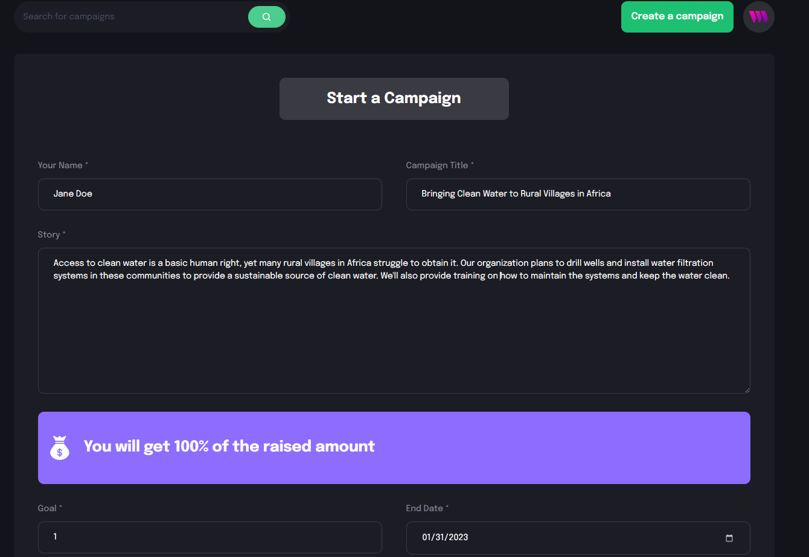
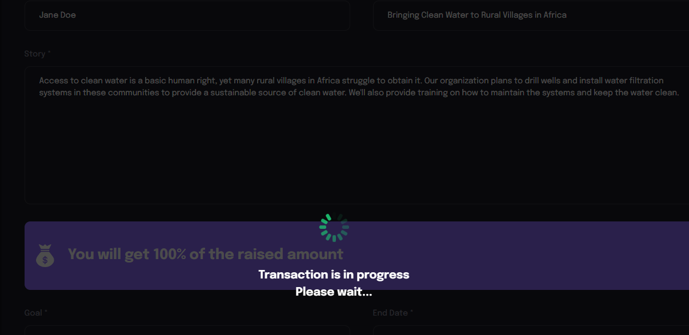

# Web-3.0-Crowdfund

- Built a crowd funding platform featuring:
    - Metamask integration
    - Interaction with smart contracts
- Utilized Solidity to write smart contracts and the Ethereum blockchain to facilitate transactions
    - Created, viewed, and donated to crowdfunding campaigns directly through the blockchain
- Demonstrated expertise in:
    - Web3
    - Blockchain technology
    - Solidity
    - Smart contract development
